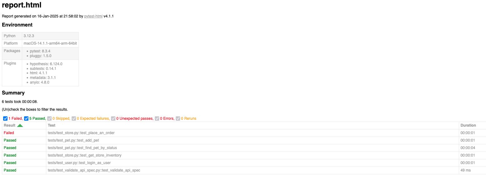

# python-api-docker
Dockerized api tests in python.  

Target API: https://petstore.swagger.io

## Setting up env

Development has been performed within a virtual python environment, isolating impact and dependencies from the host system.

## Local run

1. run `python3 -m venv venv` to create a virtual env
2. run `source venv/bin/activate` to activate the virtual env
3. run `pip install ./requirements.txt` to install all python dependencies

## Tests

1. run `python3 src/get_api_spec.py` to generate pet store api spec
2. run `pytest --html=report.html --self-contained-html`

